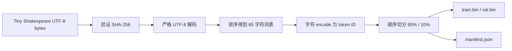

# Lesson 01：字符、token 与数据集

这一课先不训练神经网络。我们只完成一件基础但关键的事：把文本确定性地变成整数序列。

如果这一步不稳定，后面的训练 loss、量化误差、C 推理对齐和真机输出都无法公平比较。

## 1. 这一课学什么

完成本课后，你应该能解释：

- character、token、token ID 和 vocabulary 的区别；
- 语言模型的输入和目标为什么只相差一个位置；
- 同一段文本如何确定性地变成整数；
- 为什么训练集和验证集必须分开；
- 为什么数据哈希是可复现实验的一部分；
- `train.bin` 将怎样进入下一课的 embedding 层。

## 2. 从字符到 token

考虑一段很小的文本：

```text
cab
```

这里还包含最后的换行符 `\n`。本项目把每个字符当作一个 token，并按 Unicode code point 排序词表：

```text
token ID 0 -> "\n"
token ID 1 -> "a"
token ID 2 -> "b"
token ID 3 -> "c"
```

于是：

```text
"cab\n" -> [3, 1, 2, 0]
```

反向查表又能得到原文：

```text
[3, 1, 2, 0] -> "cab\n"
```

几个容易混淆的概念：

- **字符**是文本里的一个符号，例如 `c`。
- **token**是模型处理的基本单位。本课规定一个字符就是一个 token。
- **token ID**是 token 在词表中的整数编号。
- **词表**是 token 与 token ID 之间的固定映射。
- **tokenizer**负责 encode 和 decode，不负责理解文本含义。

字符级 tokenizer 的优点是透明、没有未知单词、非常适合学习和 C 实现。缺点是序列较长；以后处理物理文档时，我们会再比较 BPE 等子词 tokenizer。

## 3. 语言模型到底在学什么

语言模型学习的是：

> 给定前面的 token，下一个 token 最可能是什么？

若 token 序列为：

```text
[3, 1, 2, 0]
```

训练输入和目标是：

```text
input  = [3, 1, 2]
target = [1, 2, 0]
```

每个位置的目标都是右边紧邻的 token。后面的 causal attention 会保证当前位置看不到未来答案。

模型不会直接接收字符 `c`。下一课的 embedding 表会用 token ID `3` 取出一个可训练向量，Transformer 处理这些向量，最后输出对 65 个可能字符的 logits。

## 4. 数据管线



我们采用顺序切分，而不是随机打乱字符：

- 前 90% 为训练集；
- 后 10% 为验证集。

文本的局部顺序就是语言结构。若先把单个字符随机打散，模型将失去句子和对话的连续关系。

## 5. 为什么词表必须排序

集合本身没有我们想依赖的语义顺序。若一次运行把 `a` 编成 `17`，另一次编成 `42`，那么相同 checkpoint 会解释成不同字符。

`build_vocabulary` 使用：

```python
tuple(sorted(set(text)))
```

只要源文本相同，token ID 映射就相同。源文本的 SHA-256 又保证我们讨论的确实是同一组 bytes。

这不仅是训练细节。最终 C runtime 也必须读取完全相同的有序词表，否则 PyTorch/C greedy 解码不可能一致。

## 6. 为什么使用 `uint16-le`

Tiny Shakespeare 只有 65 个 token，理论上 `uint8` 足够。首版仍使用 little-endian `uint16`，原因是：

1. 与官方 nanoGPT 的 Shakespeare 数据表示保持接近；
2. 未来可以容纳最多 65,536 个 token ID；
3. C 端读取规则清楚，文件长度应严格等于 token 数乘以 2；
4. 先保持格式简单稳定，再用测量决定是否压成 `uint8`。

`uint16-le` 指每个 token 占两个字节，低位字节在前。例如：

```text
[1, 0x0203] -> 01 00 03 02
```

这些数据文件只在电脑训练时使用，不会被当作 Nspire 模型权重复制到设备。

## 7. 代码逐函数说明

实现位于 [`training/nanogpt_nspire/data.py`](../../training/nanogpt_nspire/data.py)。

### `sha256_bytes(data)`

输入 exact bytes，输出小写 SHA-256 十六进制字符串。它不对文本做换行或编码转换。

### `build_vocabulary(text)`

检查文本非空，然后返回排序且无重复的字符 tuple。空文本会抛出 `DatasetError`。

### `encode_text(text, vocabulary)`

先验证词表：

- 不能为空；
- 每个项目必须恰好是一个字符；
- 不能有重复字符。

然后逐字符查表并返回 token ID list。遇到词表外字符时，错误信息会指出字符和位置，而不是静默替换。

### `decode_tokens(tokens, vocabulary)`

执行 encode 的逆过程。负数、非整数或超过词表范围的 token ID 都会失败。

### `split_tokens(tokens, train_fraction=0.9)`

使用 `int(len(tokens) * train_fraction)` 作为边界，也就是向下取整。比例必须严格位于 0 和 1 之间，且两侧都至少保留一个 token。

### `pack_u16_le(tokens)`

检查每个 ID 能否放入 `uint16`，再输出明确的小端字节流。在大端电脑上会先做 byteswap，因此文件格式不随 Host CPU 改变。

### `fetch_tiny_shakespeare(output_path)`

从固定 URL 下载源文本，限制最大下载量为 8 MiB，校验固定 SHA-256。只有校验通过后才以原子替换方式写入目标文件。

### `prepare_dataset(source_path, output_dir)`

完整执行：

1. 读取 exact source bytes；
2. 限制源文件大小并严格解码 UTF-8；
3. 构造词表并 encode；
4. 顺序切分；
5. 写 `train.bin` 与 `val.bin`；
6. 最后写 `manifest.json`。

每个文件先写临时文件、flush、`fsync`，再替换最终路径。manifest 最后写，因此它可以作为本轮准备完成的标志。

### `main(argv=None)`

提供 `fetch` 和 `prepare` 两个子命令。输入、网络、编码或格式错误会返回非零退出码并打印明确原因。

## 8. 亲自运行

在仓库根目录执行：

```powershell
python -m pip install -e .
python -m pytest -q
python -m nanogpt_nspire.data fetch `
  --output artifacts/raw/tinyshakespeare.txt
python -m nanogpt_nspire.data prepare `
  --input artifacts/raw/tinyshakespeare.txt `
  --output artifacts/data/tinyshakespeare
```

`pip install -e .` 是 editable install：Python 会直接使用当前工作区里的源码，修改代码后不需要反复复制安装。

生成目录为：

```text
artifacts/
├── raw/
│   └── tinyshakespeare.txt
└── data/
    └── tinyshakespeare/
        ├── train.bin
        ├── val.bin
        └── manifest.json
```

整个 `artifacts/` 被 `.gitignore` 排除。

## 9. 2026-07-27 实际验收结果

源文本：

| 项目 | 观测值 |
|---|---:|
| Bytes / 字符 / token | 1,115,394 |
| 词表大小 | 65 |
| SHA-256 | `86c4e6aa9db7c042ec79f339dcb96d42b0075e16b8fc2e86bf0ca57e2dc565ed` |

生成产物：

| 文件 | Bytes | SHA-256 |
|---|---:|---|
| `train.bin` | 2,007,708 | `6ec305602a99ac2802745a134e1f5e33e2231b4855525b00b9aebb730ac2626f` |
| `val.bin` | 223,080 | `d37d30cc0c8327c270d493299c3dca54135f6d5f1c9ef60cda78076e311204b1` |
| `manifest.json` | 1,277 | `85158d7cee416de47904f32f062ed39271964613c7ecdaca0b1df9e40499b093` |

切分结果：

```text
train tokens      = 1,003,854
validation tokens =   111,540
total tokens      = 1,115,394
```

独立检查确认：

- `train.bin` bytes = `1,003,854 × 2`；
- `val.bin` bytes = `111,540 × 2`；
- manifest 内哈希与磁盘文件重新计算结果相同；
- 真实源文件哈希与代码固定值相同；
- Lesson 01 最终单元测试验收为 `9 passed`。

## 10. 与三模型比较的关系

Direct-Small、Quantized-Small 和 Distilled-Small 必须使用这同一份数据 manifest。否则模型质量变化可能来自不同数据，而不是训练、量化或蒸馏技术。

以后每个实验摘要都会引用：

- source SHA-256；
- schema version；
- 词表；
- split 和 token 数；
- 代码提交。

这就是整个公平比较的第一块地基。

## 11. 小练习

不必马上提交代码，可以先口头思考：

1. 如果交换词表里 `a` 和 `b` 的 token ID，但不重新训练，会发生什么？
2. 为什么 validation 不能参与梯度更新？
3. `uint8` 会让这两个 `.bin` 文件缩小多少？
4. 如果在下载后自动把 `LF` 换成 `CRLF`，源哈希、token 数和模型会怎样变化？

下一课会从 `train.bin` 取出一段 token，构造 input/target batch，并把 token ID 送进 embedding 表。
