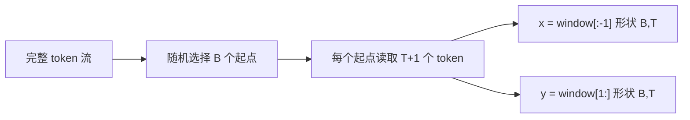

# Lesson 02：batch、embedding、logits 与 loss

Lesson 01 把字符变成了 token ID。这一课让这些整数第一次进入可训练模型。

我们故意使用一个没有 attention、没有位置编码、没有 MLP 的极小基线：

```text
token ID -> embedding -> linear vocabulary head -> logits -> cross-entropy
```

它能学习“看到当前字符后，下一个字符通常是什么”，却不能利用更长上下文。这个限制正是它的教学价值：下一课加入 causal self-attention 后，我们可以测量上下文究竟带来了什么。

## 1. 本课目标

完成本课后，你应该能解释：

- input 和 target 为什么相差一个 token；
- batch size、block size、embedding dimension 和 vocabulary size；
- embedding 为什么是可训练查表；
- logits、softmax、概率和 cross-entropy 的关系；
- validation loss 与 bits-per-character；
- 为什么本课模型不是 Transformer；
- 张量形状将怎样变成未来 C runtime 的数组和循环。

## 2. 从 token 流构造训练样本

设一段 token 流为：

```text
[3, 1, 2, 0, 4]
```

若 `block_size = 4`，取出长度为 5 的 window，再错开一位：

```text
window = [3, 1, 2, 0, 4]
input  = [3, 1, 2, 0]
target = [1, 2, 0, 4]
```

这里同时包含四个 next-token 任务：

```text
3 -> 1
1 -> 2
2 -> 0
0 -> 4
```

一次训练不会只取一个 window。`batch_size = B` 表示随机抽取 B 个 window，堆成两个形状均为 `(B, T)` 的张量；`T` 就是 `block_size`。



随机起点来自调用者持有的 `torch.Generator`。相同 seed 会得到相同 batch，因此实验可以复核。

## 3. 四个关键维度

本课反复出现四个字母：

| 符号 | 含义 | 本次真实实验配置 |
|---|---|---:|
| `B` | batch size，一次并行处理多少段文本 | 64 |
| `T` | block size，每段包含多少个位置 | 64 |
| `C` | embedding dimension，每个 token 向量多宽 | 32 |
| `V` | vocabulary size，可能输出多少种 token | 65 |

模型输入是整数张量：

```text
token_ids: (B, T)
```

embedding 后变成浮点张量：

```text
embeddings: (B, T, C)
```

线性词表头再把每个 C 维向量映射成 V 个分数：

```text
logits: (B, T, V)
```

## 4. embedding 是什么

`nn.Embedding(V, C)` 本质上是一张形状为 `(V, C)` 的可训练表。

假设 token ID 是 `17`，embedding 层就读取第 17 行：

```python
vector = embedding_weight[17]
```

初始化时每一行只是随机数。反向传播会逐渐调整这些向量，使具有相似 next-token 行为的字符获得有用表示。

embedding 不是手写词典，也不是预先规定的字符含义。它的值来自训练目标。

本课模型又用一张独立的线性权重矩阵，把 C 维 embedding 投影到 V 个 logits。参数量为：

```text
embedding 参数 = V × C
lm_head 参数   = V × C
总参数         = 2 × V × C
```

在 `V=65, C=32` 时：

```text
参数量 = 2 × 65 × 32 = 4,160
FP32 原始参数字节 = 4,160 × 4 = 16,640 bytes
```

这远小于最终 Nspire 模型，只是用来理解训练闭环。

## 5. logits 不是概率

logits 是任意实数分数，例如：

```text
[2.0, -1.0, 0.5]
```

它们不要求非负，和也不等于 1。softmax 把 logits `z_i` 转成概率：

```text
p_i = exp(z_i) / sum_j exp(z_j)
```

分数最大的 token 概率最高，但其他 token 通常仍有非零概率。

训练时我们不需要先在代码里显式调用 softmax。PyTorch 的 `cross_entropy` 在数值稳定的实现中组合了 log-softmax 和 negative log-likelihood。

## 6. cross-entropy 在惩罚什么

若正确 target 的模型概率是 `p_target`，单个位置的 loss 为：

```text
loss = -ln(p_target)
```

- 正确 token 概率接近 1，loss 接近 0；
- 正确 token 概率很小，loss 很大。

对 batch 中所有 `B × T` 个位置取平均，就得到本次训练的标量 loss。反向传播计算每个参数怎样改变才能降低它。

如果 65 个字符完全等概率，uniform random loss 是：

```text
ln(65) ≈ 4.1744
```

因此验证 loss 是否明显低于 `4.1744`，是比“生成文字看起来有点像英语”更可靠的第一判断。

## 7. bits-per-character

cross-entropy 默认使用自然对数，单位可看作 nats。字符语言模型也常报告 bits-per-character：

```text
BPC = loss / ln(2)
```

均匀猜测 65 个字符需要：

```text
log2(65) ≈ 6.0224 bits/character
```

BPC 越低，表示模型平均用越少的信息量描述下一个字符。但不同 tokenizer 的 BPC 不能不加说明地直接比较；本项目三条小模型路线会固定使用同一字符词表。

## 8. 为什么这个模型不能理解上下文

实现只有：

```python
self.token_embedding = nn.Embedding(V, C)
self.lm_head = nn.Linear(C, V, bias=False)
```

位置 `t` 的计算为：

```text
logits[t] = lm_head(token_embedding[token_id[t]])
```

它没有读取 `token_id[t-1]`、`token_id[t-2]` 或更早位置。

即使训练 batch 的 `block_size` 是 64，每个位置仍只根据自己的当前字符预测下一个字符。`block_size` 在本课只提高并行训练效率，不会给模型上下文能力。

所以它接近一个可学习的字符转移表，不是 Transformer，也不能作为最终 Nspire 文本模型。

## 9. 数据加载与错误边界

实现位于 [`training_dataset.py`](../../training/nanogpt_nspire/training_dataset.py)。

### `TokenDataset`

不可变 dataclass，保存：

- `train`：一维 `torch.long` 训练 token；
- `validation`：一维 `torch.long` 验证 token；
- `vocabulary`：有序字符 tuple；
- `manifest`：Lesson 01 的已验证元数据。

### `load_token_dataset(data_dir)`

训练前重新检查：

- schema version；
- `uint16-le` dtype；
- 词表长度与唯一性；
- token 数量；
- 文件字节数；
- SHA-256；
- token ID 是否落在词表范围内。

任何检查失败都抛出 `DatasetError`，不会把损坏数据交给 PyTorch。

### `make_batch(...)`

要求一维 `torch.long` token 流以及正整数 `batch_size`、`block_size`。它先在 CPU 选择起点并切片，最后才把完成的 `(x, y)` batch 移到 CPU 或 CUDA。

这个边界以后可以复用于 Direct-Small、teacher 和 Distilled-Small。

## 10. 模型代码

模型位于 [`embedding_lm.py`](../../training/nanogpt_nspire/models/embedding_lm.py)。

### `EmbeddingLanguageModel`

构造器只创建 embedding 和无 bias 的线性词表头。`parameter_count` 返回真实可训练标量数。

### `forward(token_ids, targets=None)`

它先检查：

- 输入必须是二维 `(B, T)`；
- dtype 必须是 `torch.long`；
- token ID 必须在 `[0, V)`；
- targets 与 inputs 形状必须相同。

然后执行：

```text
(B,T) -> embedding -> (B,T,C) -> linear -> (B,T,V)
```

提供 targets 时，把 logits 展平为 `(B×T, V)`，targets 展平为 `(B×T)`，再计算一个标量 cross-entropy。

## 11. 训练命令

训练入口位于 [`lesson02_train.py`](../../training/nanogpt_nspire/lesson02_train.py)。

真实基线命令为：

```powershell
python -m nanogpt_nspire.lesson02_train `
  --data-dir artifacts/data/tinyshakespeare `
  --output-dir artifacts/lesson02 `
  --device auto `
  --seed 1337 `
  --steps 1000 `
  --batch-size 64 `
  --block-size 64 `
  --embedding-dim 32 `
  --learning-rate 0.05 `
  --eval-batches 50 `
  --sample-tokens 300 `
  --source-commit <implementation-commit>
```

`--device auto` 在当前电脑会选择 CUDA；测试始终可以在 CPU 运行。

训练输出：

```text
artifacts/lesson02/
├── embedding_lm.pt
└── run.json
```

二者均被 Git 忽略。仓库只提交体积受控的实验摘要。

## 12. 训练入口逐函数说明

### `TrainingConfig.validate()`

在读取数据或分配模型前拒绝非正的 step、batch、block、embedding、eval 数量，以及非法 seed、learning rate 和 sample 长度。

### `resolve_device(requested)`

支持 `auto`、`cpu` 和可用的 `cuda`。请求不存在的 CUDA 时明确失败，不静默退回 CPU。

### `evaluate_loss(...)`

每次使用全新的固定 seed generator，因此训练前后验证 loss 使用相同的验证窗口，减少采样差异。

### `bits_per_character(loss)`

把自然对数 cross-entropy 除以 `ln(2)`。

### `sample_token_ids(...)`

使用固定 seed 和温度采样。由于当前模型只看最后一个字符，采样结果主要反映局部字符转移。

### `run_training(config)`

完成数据复核、模型初始化、初始验证、AdamW 训练、最终验证、采样和 checkpoint。摘要记录数据哈希、环境、模型配置、loss、BPC、训练耗时和产物哈希。

## 13. 测试驱动证据

实现前的测试分别在缺失模块处失败：

- `nanogpt_nspire.training_dataset` 不存在；
- `nanogpt_nspire.models` 不存在；
- `nanogpt_nspire.lesson02_train` 不存在。

实现后：

- Lesson 01 数据测试：9 项；
- Lesson 02 dataset/batch 测试：7 项；
- embedding 模型测试：7 项；
- 训练入口测试：5 项；
- 当前合计：`28 passed`。

其中一个小型 CPU 测试让模型学习确定的 `a -> b`、`b -> a` 转移，确认梯度确实经过 embedding、线性层和 cross-entropy。

## 14. 真实实验结果

实验使用实现提交：

```text
38653f82e01265baf863391fa1e6d0ac4b1fdb74
```

完整有界摘要位于 [`experiments/lesson02-embedding-baseline.json`](../../experiments/lesson02-embedding-baseline.json)。

### 14.1 配置与环境

| 项目 | 观测值 |
|---|---:|
| GPU | NVIDIA GeForce RTX 5080 Laptop GPU |
| PyTorch / CUDA | 2.10.0+cu130 / 13.0 |
| Python | 3.13.5 |
| Steps | 1,000 |
| Batch / block | 64 / 64 |
| Embedding dimension | 32 |
| 参数量 | 4,160 |
| 训练 token | 4,096,000 |
| 训练时间 | 1.5992 s |
| 本机训练吞吐 | 2,561,294 token/s |

吞吐只描述这台电脑上的极小 CUDA 训练，不是 Nspire 推理速度。该模型非常小，GPU 启动和框架开销占比很高。

### 14.2 验证指标

训练前后使用相同 seed 选出的 50 个 validation batch：

| 指标 | 训练前 | 训练后 |
|---|---:|---:|
| Validation loss | 4.343535 | 2.497522 |
| BPC | 6.266397 | 3.603162 |

uniform random loss 为 `4.174387`。随机初始化模型最初略差于均匀猜测，训练后 loss 降低 `1.846013`，相对下降约 `42.50%`。

这证明仅根据当前字符，模型已经能学习有用的局部转移，例如空格后更可能出现字母、某些辅音后更可能出现特定元音。但它无法区分相同字符在不同长上下文中的作用。

### 14.3 固定 seed 样例

采样 seed 为 `1340`，temperature 为 `0.8`：

```text
Ben ad my.
tre
A:
Thareoret mp heres whis s f s iste II irerd t nd toed a misengomy win veg: ther thingenghe asthen godis:
HENioves mesporowh s meral.


ARIf th t an sag andetherore? t s p wot f cere I LAn m:
Angathelere glantha lousthengeasss t wore orers melongher hanoume piere wh ten dnd th w ang
```

它出现了类似姓名、换行、冒号和英文局部拼写的结构，但句子没有稳定语义。这与模型只能学习单字符转移的能力一致。

### 14.4 checkpoint 与复核

| 项目 | 观测值 |
|---|---|
| FP32 参数原始大小 | 16,640 bytes |
| PyTorch checkpoint | 19,341 bytes |
| Checkpoint SHA-256 | `e528154ebd969c049e48345f9521a1a67ac951a5739bec9c71ecec22c7d1707a` |
| Peak CUDA allocated | 21,942,272 bytes |

checkpoint 比原始参数多出的字节来自格式和元数据，不代表部署格式开销。Peak CUDA allocation 是 PyTorch 训练内存，也不是未来 C/Nspire 推理内存。

独立复核已经完成：

- checkpoint 以 strict state-dict 方式重新加载；
- state dict 只有 `token_embedding.weight` 和 `lm_head.weight`；
- checkpoint 与 `run.json` 的 source commit 一致；
- 相同验证窗口复现出完全相同的最终 loss；
- 相同 seed 逐字复现 301 字符样例；
- checkpoint 和 `run.json` 都位于被 Git 忽略的 `artifacts/`。

本课结论只到这里：embedding 基线已学习字符级局部统计。它不是 Transformer，也没有证明任何长上下文理解能力。

下一课会在保留相同数据、batch 和评价代码的前提下加入 causal self-attention。
