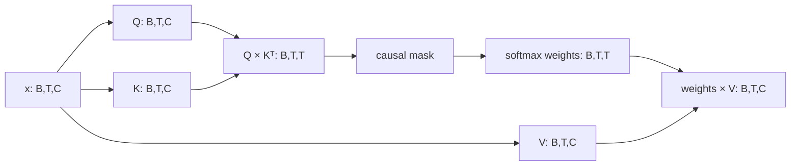

# Lesson 03：单头 causal self-attention

Lesson 02 的模型只根据当前字符预测下一个字符。即使 batch 中有 64 个连续位置，各位置之间也没有信息交换。

这一课第一次让位置 `t` 主动读取位置 `0...t` 的表示：

```text
token + position
  -> Query / Key / Value
  -> scaled dot-product scores
  -> causal mask
  -> softmax attention weights
  -> weighted sum of Values
  -> residual connection
  -> logits
```

为了看清 attention 本身，本课只有一个 head，并且暂不加入 LayerNorm、MLP、dropout 或堆叠 block。

## 1. 本课目标

完成本课后，你应该能解释：

- 为什么 token embedding 之外还需要 position embedding；
- Query、Key、Value 分别在做什么；
- `(B,T,C)` 如何产生 `(B,T,T)` attention matrix；
- 为什么 dot product 要除以 `sqrt(C)`；
- causal mask 如何阻止未来信息泄漏；
- softmax 每一行为什么和为 1；
- residual connection 为什么保留原表示；
- attention 的时间和内存开销为什么随 `T²` 墤长；
- 为什么本课模型仍不是完整 nanoGPT。

## 2. 为什么需要上下文

当前字符常常不足以决定下一个字符。

例如同一个字符 `t` 后面可能出现：

```text
th
to
tr
tt
```

更早的单词、标点和说话人信息会改变合理选择。Lesson 02 对所有 `t` 使用同一个输出分布，无法根据上下文调整。

self-attention 的目标是为每个位置动态构造一个“从过去收集来的上下文向量”。

## 3. position embedding

token embedding 只说明“这是什么 token”，不说明“它在序列哪里”。

本课把两个向量相加：

```text
x[b,t] = token_embedding[token_id[b,t]]
       + position_embedding[t]
```

形状为：

```text
token embedding:    (B,T,C)
position embedding:   (T,C)
x:                  (B,T,C)
```

PyTorch 会把 `(T,C)` 广播到 batch 的每个样本。

position embedding 是一张可训练的 `(block_size,C)` 表。本课使用 learned absolute positions，与官方 nanoGPT 的入门结构一致。

## 4. Query、Key、Value

同一个 hidden vector `x` 经过三组不同的线性变换：

```text
Q = x W_Q
K = x W_K
V = x W_V
```

三者形状都为 `(B,T,C)`。

可以先用一个不严格但有帮助的比喻理解：

- **Query**：当前位置想找什么？
- **Key**：每个历史位置提供什么匹配标签？
- **Value**：若关注这个位置，实际取走什么内容？

位置 `i` 的 Query 与位置 `j` 的 Key 做 dot product。分数越大，表示位置 `i` 越应该关注位置 `j`。

## 5. 从 Q/K 得到 `(T,T)` 分数矩阵

矩阵运算为：

```text
scores = Q @ K.transpose(-2,-1)
```

形状变化：

```text
Q:                     (B,T,C)
K.transpose(-2,-1):    (B,C,T)
scores:                (B,T,T)
```

`scores[b,i,j]` 表示 batch `b` 中，位置 `i` 对位置 `j` 的未归一化关注分数。



## 6. 为什么除以 `sqrt(C)`

若 Q/K 各维数值方差相近，C 个乘积相加后，dot product 的尺度会随 C 增大。

过大的 logits 会让 softmax 很快接近 one-hot，梯度变得不友好。因此使用：

```text
scores = (Q @ Kᵀ) / sqrt(C)
```

这就是 scaled dot-product attention 中的 “scaled”。

## 7. causal mask

训练时 target 已经存在于同一个 window 里。如果位置 `i` 能读取 `i+1`，模型会直接偷看未来答案。

长度 `T=4` 的可见性矩阵为：

```text
1 0 0 0
1 1 0 0
1 1 1 0
1 1 1 1
```

对角线保留，因为位置可以读取当前 token；严格上三角是未来，必须屏蔽。

实现把不可见分数替换为负无穷：

```python
scores = scores.masked_fill(~visible, float("-inf"))
```

softmax 后，未来位置的权重严格为 0。

本项目不只检查代码里有没有三角 mask，还进行行为测试：

> 修改未来 token，不得改变更早位置的 logits。

这比查看某个 buffer 更接近真正的因果性要求。

## 8. softmax 权重和 Value 混合

mask 后沿最后一维做 softmax：

```text
weights = softmax(scores, dim=-1)
```

每个 query 位置对应一行权重：

- 所有权重非负；
- 可见位置权重之和为 1；
- 未来位置权重为 0。

然后：

```text
context = weights @ V
```

形状：

```text
weights: (B,T,T)
V:       (B,T,C)
context: (B,T,C)
```

所以每个新向量是过去 Value 的加权和，且权重会随输入内容动态变化。

## 9. output projection 和 residual

混合后的 context 再经过一层 `C -> C` 投影：

```text
attention_output = context W_O
```

本课随后做：

```text
hidden = x + attention_output
```

这条 residual connection 让模型既保留原始 token/position 表示，也叠加从上下文取得的信息。若 attention 暂时没学好，原表示仍有一条直接路径传到 vocabulary head。

我们暂时不加入 LayerNorm，因为本课要隔离 attention；下一阶段构造完整 Transformer block 时再解释 pre-norm。

## 10. 代码结构

模型位于 [`causal_attention_lm.py`](../../training/nanogpt_nspire/models/causal_attention_lm.py)。

### `SingleHeadCausalSelfAttention`

参数：

- `W_Q`：`C × C`；
- `W_K`：`C × C`；
- `W_V`：`C × C`；
- `W_O`：`C × C`。

它注册一个不可训练的 boolean lower-triangular mask。mask 设置为 `persistent=False`，因为可由 block size 重新构造，不必写进 checkpoint。

`forward(inputs, return_weights=False)` 要求 `(B,T,C)`，返回 `(B,T,C)`；教学测试可请求同时返回 `(B,T,T)` weights。

### `SingleHeadCausalLanguageModel`

包含：

1. token embedding；
2. position embedding；
3. single-head causal attention；
4. residual connection；
5. vocabulary head。

总参数量：

```text
token embedding     = V × C
position embedding  = T × C
Q/K/V/O             = 4 × C²
vocabulary head     = V × C
总计                = 2VC + TC + 4C²
```

本课真实配置 `V=65,T=64,C=64` 时：

```text
总参数 = 28,800
FP32 原始参数 = 115,200 bytes
```

## 11. 计算成本和 Nspire 联系

Q/K/V 投影大约随 `T × C²` 增长。attention score 和 Value 混合随：

```text
T² × C
```

增长，而 `(T,T)` weights 的内存随 `T²` 增长。

这对 Nspire 很重要：

- block size 翻倍，attention matrix 元素数约变成四倍；
- 生成时若每次重算完整上下文，速度会越来越慢；
- 以后需要比较较短 context、KV cache 和整数算子；
- 当前 PyTorch CUDA 速度不能推断 ARM C 真机速度。

因此 `block_size=64` 不只是教学选择，也是第一轮受限设备实验的合理起点。

## 12. 上下文采样

Lesson 02 生成时只输入最后一个 token，因为模型看不见更早内容。

本课的 [`sample_with_context`](../../training/nanogpt_nspire/lesson03_train.py) 保留完整生成序列，但每次只输入最近：

```text
min(current_length, block_size)
```

个 token。

超过 block size 后，最早 token 被裁掉。模型永远不会收到超出 position embedding 表的序列。

固定 prompt、checkpoint、seed 和 temperature 必须生成同一 token 序列。

## 13. 共享训练支持

共同函数已提取到 [`training_support.py`](../../training/nanogpt_nspire/training_support.py)：

- `resolve_device`；
- `bits_per_character`；
- `evaluate_loss`；
- `synchronize`；
- `sha256_file`；
- `write_json_atomic`；
- `dataset_summary`；
- `environment_summary`。

Lesson 02 仍从原入口导出原有名字，既有测试验证重构没有改变它的行为。

模型 checkpoint、配置和采样仍由各课独立定义，避免过早建造复杂训练框架。

## 14. 测试证据

Lesson 03 新增的结构测试验证：

- attention output 和 weights 形状；
- 每行 weights 和为 1；
- 严格上三角权重为 0；
- 修改未来 token 不改变较早 logits；
- 超过 block size 明确失败；
- 参数公式与实际参数一致；
- synthetic delimiter 任务必须读取较早 context 才能学习。

训练入口测试验证：

- 生成输入始终裁剪到 block size；
- 固定 seed 生成可复现；
- 非法配置在训练前失败；
- 小型 CPU run 能写出 checkpoint 和 summary。

当前全套测试为 `42 passed`。

## 15. 真实实验命令

代码提交后使用：

```powershell
python -m nanogpt_nspire.lesson03_train `
  --data-dir artifacts/data/tinyshakespeare `
  --output-dir artifacts/lesson03 `
  --device auto `
  --seed 1337 `
  --steps 2000 `
  --batch-size 64 `
  --block-size 64 `
  --embedding-dim 64 `
  --learning-rate 0.003 `
  --eval-batches 50 `
  --sample-tokens 300 `
  --temperature 0.8 `
  --source-commit <implementation-commit>
```

生成：

```text
artifacts/lesson03/
├── single_head_attention_lm.pt
└── run.json
```

两者均被 Git 忽略。

## 16. 真实实验结果

实现提交后，本节将记录：

- 初始与最终 validation loss/BPC；
- 与 Lesson 02 `2.497522 / 3.603162 BPC` 的同窗口比较；
- 参数量和训练成本差异；
- checkpoint 严格重载与固定 seed 复现；
- 生成文本是否出现更长结构；
- 结论边界：这不是 size-matched 部署比较。

## 17. 还缺什么才是完整 Transformer block

本课尚未包含：

- multi-head attention；
- LayerNorm；
- MLP/GELU；
- dropout；
- 多个 block 堆叠；
- weight tying；
- KV cache。

下一课会在本课已验证的 causal attention 上构造更接近 nanoGPT 的完整 Transformer block，并重新计算参数、内存和真机预算。
